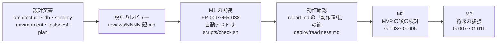

# 図: 開発ロードマップ

- 対応する FR: FR-001〜FR-038（すべて M1）
- 対応する ADR: 0001（M1 の範囲の FR-002・FR-038）
- 対応する文書: `roadmap.md`・`mvp.md`・`gaps.md`
- 確かめた M: M1

```mermaid
flowchart LR
    design["設計文書<br/>architecture・db・security<br/>environment・tests/test-plan"]
    review["設計のレビュー<br/>reviews/NNNN-題.md"]
    impl["M1 の実装<br/>FR-001〜FR-038<br/>自動テストは scripts/check.sh"]
    verify["動作確認<br/>report.md の「動作確認」の節<br/>deploy/readiness.md"]
    m2["M2<br/>MVP の後の検討<br/>G-003〜G-006"]
    m3["M3<br/>将来の拡張<br/>G-007〜G-011"]
    design --> review --> impl --> verify --> m2 --> m3
```
